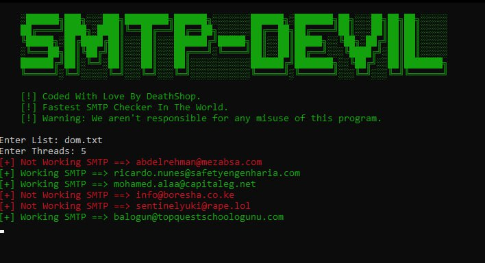

# SMTP-Devil

SMTP-Devil is a powerful tool designed to check the functionality of SMTP servers efficiently. By sending test emails using provided credentials, it ensures the reliability and effectiveness of SMTP configurations. Below are some essential details and instructions for utilizing this tool effectively.

## Features

- **Multi-threaded SMTP Checking**: Perform simultaneous checks on multiple SMTP servers, enhancing efficiency.
- **TLS Encryption**: Secure communication with SMTP servers via TLS encryption ensures data integrity.
- **Certificate Bypass**: Flexibility to bypass certificate verification, accommodating self-signed or invalid certificates.
- **Timeout Mechanism**: Prevents hanging on unresponsive SMTP servers, ensuring smooth execution.

## How it Works

1. **Input Prompt**: Upon execution, follow on-screen prompts to provide necessary inputs, including the path to the list file containing SMTP server details and desired thread count.
2. **Execution**: The program initiates SMTP server checks based on the provided inputs.
3. **Result Output**: Upon completion, the program generates a file named `working.txt`, containing the details of functional SMTP servers in the same directory.

## Input File Format

- Ensure the input file adheres to the following format: list.txt path then num of threads
  

## Usage

- **Windows Users**: Utilize `smtps.exe`.
- **Linux Users**: Use `go run smtps.go`.
- **Mac Users**: Apologies, no specific version available at the moment.
- **Build Your Own Version**: Alternatively, you can build a version suitable for your system.

## Download

- You can download the latest [release](https://github.com/naiyanrahman/SMTPDEVIL/releases/tag/v1.0) from the [Release](https://github.com/naiyanrahman/SMTPDEVIL/releases/tag/v1.0)
 section.
- For direct download from the main repository, utilize `latest.go` for Go or `latest.py` for Python for automatic download.

## Get in touch
- Telegram [Mu Senrei](t.me/musenrei)
- [Email](mailto:mail.musenrei@gmailom)

**Warning**: This tool is intended for educational purposes only. Misuse of this tool to test SMTP servers without proper authorization may violate applicable laws and regulations. It is your responsibility to ensure that you have appropriate permission before using this tool on any system or network. The developer(s) of this tool shall not be held responsible for any misuse or unauthorized access resulting from the use of this software.

Feel free to explore the capabilities of SMTP-Devil and streamline your SMTP server management process effortlessly! If you encounter any issues or have suggestions, please don't hesitate to reach out. Happy SMTP testing! 📧🔥
